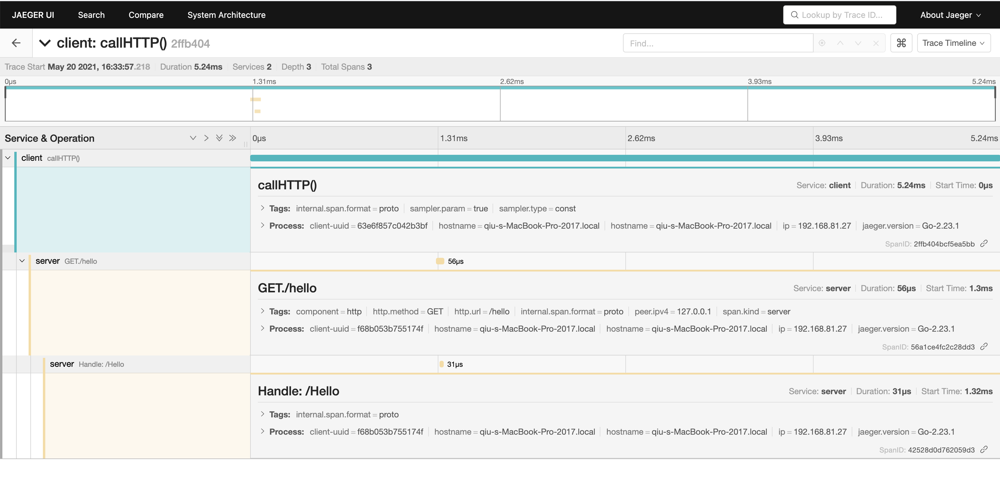

# HTTP服务
## 1 Example
[项目地址](https://github.com/gotomicro/ego/tree/master/examples/server/http)

## 2 HTTP配置
```go
type Config struct {
	Host                    string        // IP地址，默认127.0.0.1
	Port                    int           // PORT端口，默认9001
	Mode                    string        // gin的模式，默认是release模式
	EnableMetricInterceptor bool          // 是否开启监控，默认开启
	EnableTraceInterceptor  bool          // 是否开启链路追踪，默认开启
	EnableLocalMainIP       bool          // 自动获取ip地址
	SlowLogThreshold        time.Duration // 服务慢日志，默认500ms
}
```

## 3 用户配置
```toml
[server.http]
  host = "127.0.0.1"
  port = 9001
```

## 3.1 用户代码
配置创建一个 ``http`` 的配置项，其中内容按照上文配置进行填写。以上这个示例里这个配置key是``server.http``

代码中创建一个 ``HTTP`` 服务， egin.Load("{{你的配置key}}").Build() ，代码中的 ``key`` 和配置中的 ``key`` 要保持一致。创建完 ``HTTP`` 服务后， 将他添加到 ``ego new`` 出来应用的 ``Serve`` 方法中，之后使用的方法和 ``gin`` 就完全一致。

```go
package main

import (
	"github.com/gin-gonic/gin"
	"github.com/gotomicro/ego"
	"github.com/gotomicro/ego/core/elog"
	"github.com/gotomicro/ego/server/egin"
)

//  export EGO_DEBUG=true && go run main.go --config=config.toml
func main() {
	if err := ego.New().Serve(func() *egin.Component {
		server := egin.Load("server.http").Build()
		server.GET("/hello", func(ctx *gin.Context) {
			ctx.JSON(200, "Hello EGO")
			return
		})
		return server
	}()).Run(); err != nil {
		elog.Panic("startup", elog.FieldErr(err))
	}
}
```

## 4 开启链路的服务
### 4.1 用户配置
```toml
[server.http]
    port = 9007
[trace.jaeger]
    ServiceName = "server"
```
### 4.2 用户代码
```golang
//  export EGO_DEBUG=true && go run main.go --config=config.toml
func main() {
	if err := ego.New().Serve(func() *egin.Component {
		server := egin.Load("server.http").Build()
		server.GET("/hello", func(ctx *gin.Context) {
			// Get traceId from Request's context
			span, _ := etrace.StartSpanFromContext(ctx.Request.Context(), "Handle: /Hello")
			defer span.Finish()

			ctx.JSON(200, "Hello client: "+ctx.GetHeader("app"))
		})

		return server
	}()).Run(); err != nil {
		elog.Panic("startup", elog.FieldErr(err))
	}
}

```
### 4.2 jaegerUI中查看

<Vssue title="Server-http" />