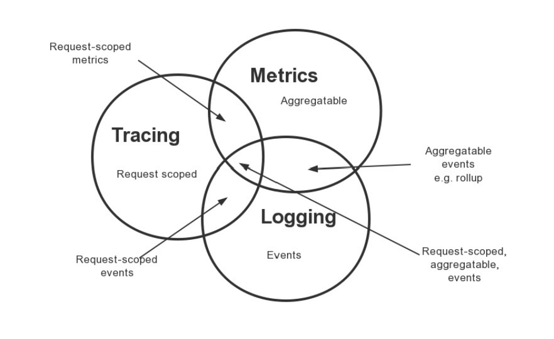
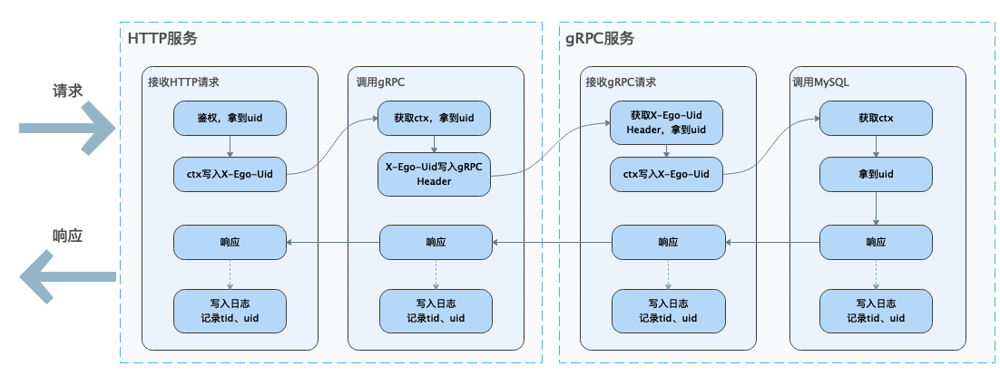

## 6 Ego Access 自定义链路

日志、链路、监控可以说是微服务治理的三驾马车，如下所示。

从图中，我们可以看到日志、链路、监控其实是有很多不一样的地方，同时又有一些交汇的地方。 我们将日志和链路的一些特性列一个表格。

| 方式    | 采集类型  | 量级    |  优势    | 调整采集   |格式   |
|  ----  | ----  | ---- |---- |---- | ----  |
| 日志    | 请求、错误、慢日志 | 中 | 聚合、错误收敛 | 调整日志级别 | 动态   |
| 链路    | 请求日志（可以细粒度到函数级别） | 大 | traceId，调用关系  | 调整采样率| 固定   |

链路记录的请求日志指标较多，同时可以细粒度到函数级别，最重要的是有全局唯一的`trace id`，能够串联各个系统的耗时、错误情况，但是他存在的最大问题是因为粒度较细，数据量巨大，只能采样，导致了有些数据可能缺失，同时他也不能聚合一些错误信息，做一些错误收敛。

而传统的框架请求日志，可以记录错误信息、错误收敛，但却没有链路的一些优秀特性。

我们可以看到日志和链路最大的共同点是都有记录请求日志，但他们的日志却无法共用，这就造成了极大的资源浪费，并且我们实际生产环境中并不需要链路细粒度到函数级别的，服务级别的链路通常就可以满足我们排查问题的需要。

所以我们在想，这两者是否能做个统一，让日志拥有聚合、错误收敛特性的同时，又能够有链路的一些优点。

在这里我们将`Ego`框架里的`access`日志改造成具有链路的特性，能够记录`trace id`串联各个服务，并且能够根据用户自定义的字段，记录`uid`、`orderId`等信息。`Ego`框架如何实现日志、链路的统一，在这里我们可以用一个获取用户信息的例子来讲述下他的数据流向。

假设我们有两个服务，一个是`HTTP` `a`服务用于将用户信息数据吐给客户端，一个是`gRPC` `b`服务用于查询MySQL，将用户信息数据返给a服务。

* 我们在`a`、`b`服务启动前配置自定义的链路属性`export EGO_LOG_EXTRA_KEYS=X-Ego-Uid`，那么框架在读到这个环境变量里`EGO_LOG_EXTRA_KEYS`，会根据逗号分割，解析用户配置了多少个自定义的链路属性，后续的`Ego`组件会根据这个属性，自动将组件日志里追加这些用户自定义属性。
* 当`a`服务接收到客户端的请求后，会根据`token`校验，校验通过后，在`http.Request.Context()`中写入`X-Ego-Uid=9527`的数据
* 然后a服务，会将`http.Request.Context()`传入到`gRPC`客户端
* `gRPC`客户端会取出`gRPC context`中的`X-Ego-Uid=9527`，并将其写入到`gRPC header`里，调用`b`服务
* `b`服务接收到`gRPC header`中的`X-Ego-Uid=9527`，将其写入到`Context`里，传入到`MySQL`客户端
* `MySQL`客户端从`Context`里获取到`X-Ego-Uid=9527`
* 最后各个组件一次响应，并异步写入日志，在日志中追加`trace-id`和`x-ego-uid`（链路id，框架已经内置，会自动追加，不需要用户配置）。

最终达到的效果，例如`MySQL`的`access`日志中记录了`uid`和`trace id`信息。

以上就是Ego将日志中实现了链路的数据流向。快来体验吧。
[如何传递和使用链路，请点击链接](https://ego.gocn.vip/frame/core/trace.html)

体验版本为：
* github.com/gotomicro/ego@v0.6.2
* github.com/gotomicro/ego-component/egorm@v0.2.2
* github.com/gotomicro/ego-component/eredis@v0.2.3